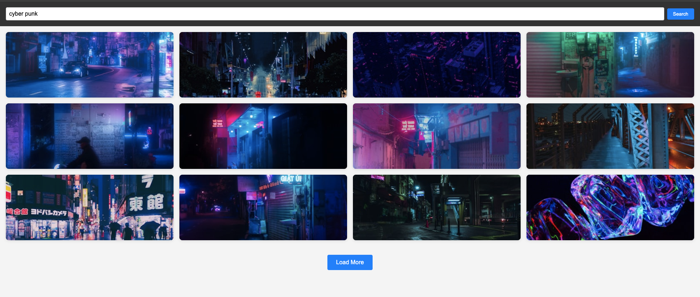

# 📷 React Image Search Gallery

A responsive image search app built with **React**, **Vite**, **Axios**, **React Router (optional)**, and the **Unsplash API**.  
Users can search photos by keyword, browse paginated results, open a modal for a larger preview, and view extra details (author, likes, description).

---

## 🚀 Demo
- **Live (Vercel):** https://image-search-gallery.vercel.app/
- **Repository:** https://github.com/zekirovskii/image-search-gallery

---

## 📸 Preview


*(Put screenshots under `public/screenshots/` such as `home.png`, `modal.png` and link them here.)*

---

## 🔑 Unsplash API Setup
1. Create a developer account on **Unsplash** and register a **New Application**.  
2. Copy your **Access Key** from the app’s **Keys** section.  
3. Create a `.env` file in the project root and add:
VITE_UNSPLASH_ACCESS_KEY=your_access_key_here
4. Requests should include the `Authorization: Client-ID ${VITE_UNSPLASH_ACCESS_KEY}` header or the `client_id` query param (per Unsplash docs).

---

## 🧩 Features
- 🔍 Keyword-based image search (Unsplash API)
- 📄 Paginated loading with **Load More** button
- 🖼️ Image list with cards (lazy-loaded thumbnails)
- 🔎 Click any card to open a **Modal** with a larger image
- 🧑 Author, ❤️ likes, and description displayed in modal
- 🔔 Empty submit prevention + **toast** notifications (React Hot Toast)
- ⚠️ Robust loading/error states
- 🎨 **CSS Modules** for component-scoped styles
- 🧹 Clean code with **Prettier**

---

## 🛠️ Tech Stack
- **React 18** + **Vite**
- **Axios**
- **React Hot Toast**
- **React Modal** (or headless UI of your choice)
- **CSS Modules**

---
```
## 📂 Project Structure
react-image-search-gallery/
│── public/
│ └── screenshots/
│ ├── home.png
│ └── modal.png
│
│── src/
│ ├── components/
│ │ ├── App/
│ │ │ ├── App.jsx
│ │ │ └── App.module.css
│ │ ├── SearchBar/
│ │ │ ├── SearchBar.jsx
│ │ │ └── SearchBar.module.css
│ │ ├── ImageGallery/
│ │ │ ├── ImageGallery.jsx
│ │ │ └── ImageGallery.module.css
│ │ ├── ImageCard/
│ │ │ ├── ImageCard.jsx
│ │ │ └── ImageCard.module.css
│ │ ├── LoadMoreBtn/
│ │ │ ├── LoadMoreBtn.jsx
│ │ │ └── LoadMoreBtn.module.css
│ │ ├── ImageModal/
│ │ │ ├── ImageModal.jsx
│ │ │ └── ImageModal.module.css
│ │ ├── Loader/
│ │ │ ├── Loader.jsx
│ │ │ └── Loader.module.css
│ │ └── ErrorMessage/
│ │ ├── ErrorMessage.jsx
│ │ └── ErrorMessage.module.css
│ │
│ ├── services/
│ │ └── unsplashApi.js
│ │
│ ├── main.jsx
│ └── index.css
│
│── .env # VITE_UNSPLASH_ACCESS_KEY=...
│── package.json
│── README.md
```
---

## ⚙️ Installation & Scripts
```bash
# 1) Clone
git clone https://github.com/username/react-image-search-gallery.git
cd react-image-search-gallery

# 2) Install
npm install

# 3) Env
echo "VITE_UNSPLASH_ACCESS_KEY=your_access_key_here" > .env

# 4) Dev
npm run dev

# 5) Build
npm run build

# 6) Preview build
npm run preview
🔌 API Notes (Unsplash)
Search endpoint (example):
GET https://api.unsplash.com/search/photos?query={keyword}&page={page}&per_page=12
Headers: Authorization: Client-ID {VITE_UNSPLASH_ACCESS_KEY}
Use urls.small for gallery thumbnails and urls.regular (or urls.full) inside the modal.
🧠 Component Responsibilities
SearchBar
Controlled input for the query.
onSubmit(query) prop.
Prevent empty submit and show toast on empty query.
ImageGallery
Receives images array and onImageClick(image).
Renders a list of ImageCard.
ImageCard
Renders img with loading="lazy".
Important: attach the click handler on the  element if your spec requires it.
LoadMoreBtn
Simple button component: onClick().
ImageModal
Uses React Modal (or similar) to show large image + author/likes/description.
Closes on overlay/ESC.
App
Holds state: images, query, page, isLoading, error, selectedImage.
Handles fetching with Axios inside useEffect for query/page changes.
Wires SearchBar → fetch; LoadMore → pagination; modal open/close.
🧪 Quality & Linting
No console errors or warnings when running.
Format with Prettier.
Keep components as default exports.
Styles with CSS Modules.
☁️ Deploy on Vercel
Import GitHub repo on Vercel.
Set Environment Variable VITE_UNSPLASH_ACCESS_KEY.
Build command: npm run build — Output: dist.
Deploy.
